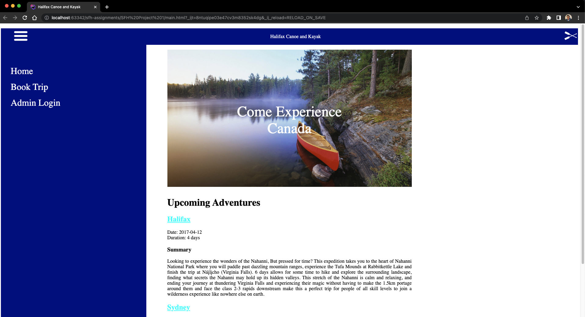
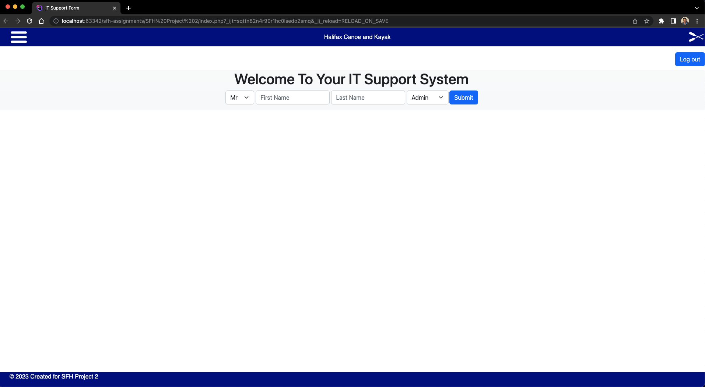
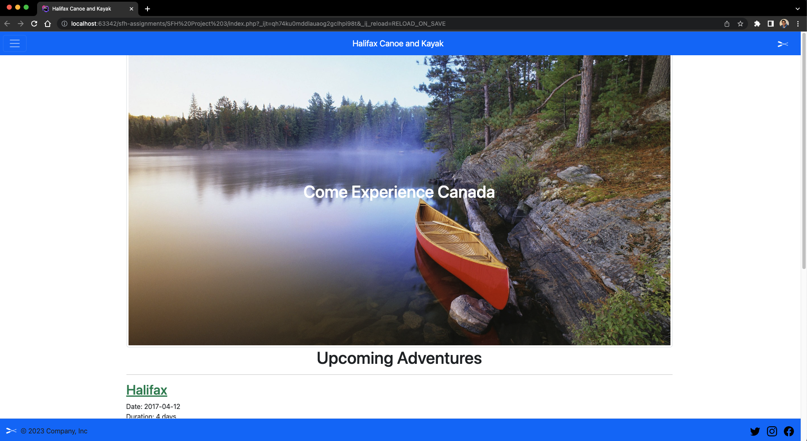
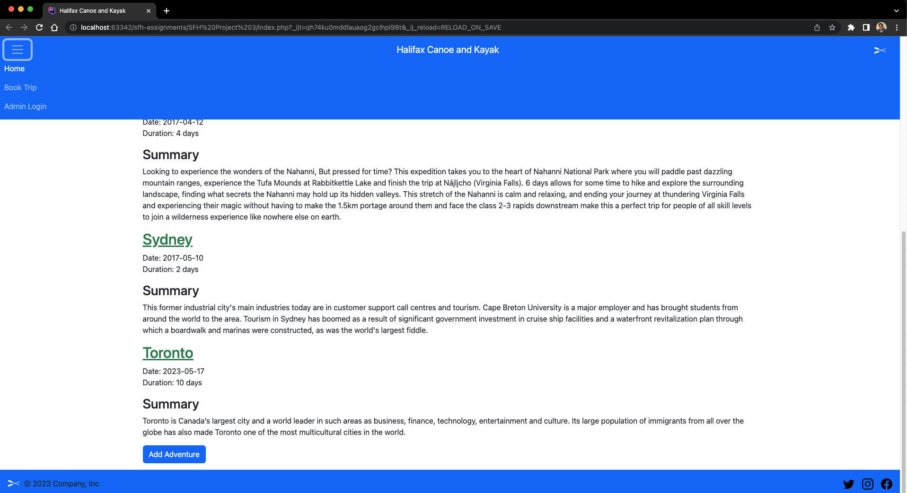

# About the Project

This respository involves TA assignments part of the Skills for Hire Web Development Program provided by Digital Nova Scotia.

### Built With

- [](https://www.php.net/)
- [](https://developer.mozilla.org/en-US/docs/Glossary/HTML5)
- [](https://developer.mozilla.org/en-US/docs/Web/CSS)
- [](https://getbootstrap.com/)
- [](https://www.jetbrains.com/phpstorm/promo/?source=google&medium=cpc&campaign=14335686201&term=phpstorm&content=540304889990&gad=1&gclid=CjwKCAjwqZSlBhBwEiwAfoZUIEZZ39Ah6temi5LI_gNLfJCySpfncFYJBNErpIkBKRO6gxIpRxlVwxoCJ40QAvD_BwE)

## Getting Started

### Prerequisites

To run this project you will need:

- [PHP](https://www.php.net/) installed on your computer. There are different ways you can achieve this, please follow any of the links as per your operating system and requirements: [MAMP](https://www.mamp.info/en/mac/), [LAMP](https://www.digitalocean.com/community/tutorials/how-to-install-linux-apache-mysql-php-lamp-stack-ubuntu-18-04), [WAMP](https://www.wampserver.com/en/).
- Any editor of your choice. Personally, I use [Visual Studio Code](https://code.visualstudio.com/download) for all my projects. But for this one, I used [PhpStorm](https://www.jetbrains.com/phpstorm/).

### Installation

1. Clone the repo

   ```markdown
   git clone https://github.com/bhaven123/sfh-assignments
   ```

2. Have your MAMP server running.

## Usage

### Screenshots

#### Project 1



#### Project 2



#### Project 3





##### Demo
